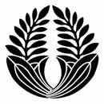
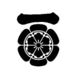

# 日本战国家纹

## 蝦夷(北海道)・東北

（蝦夷地、陸奧、出羽）

名(简) | 名(繁) | 家纹 | 介绍
------------ | ------------ | ------------- | -------------
蛎崎氏 | 蠣崎氏 |  | [简介](https://baike.baidu.com/item/%E8%9B%8E%E5%B4%8E%E6%B0%8F/24431389)
津轻氏 | 津輕氏 |  | [简介](https://zh.wikipedia.org/wiki/%E6%B4%A5%E8%BC%95%E6%B0%8F), 其後改姓大浦
浪冈北畠(tián)氏 | 浪岡北畠氏 |  | [简介](https://baike.baidu.com/item/%E6%B5%AA%E5%86%88%E5%8C%97%E7%95%A0%E6%B0%8F/13826825?fr=aladdin)
南部晴政 | 南部晴政 |  | [简介](https://zh.wikipedia.org/wiki/%E5%8D%97%E9%83%A8%E6%99%B4%E6%94%BF)
高水寺斯波氏 | 高水寺斯波氏 |  | [简介](https://zh.wikipedia.org/wiki/%E6%96%AF%E6%B3%A2%E6%B0%8F), 源自清和天皇後代源義家之子義國足利氏的後代。
葛西氏 | 葛西氏 |  | [简介](https://baike.baidu.com/item/%E8%91%9B%E8%A5%BF%E6%B0%8F/23674166?fr=aladdin)
大崎氏 | 大崎氏 |  | [简介](https://zh.wikipedia.org/wiki/%E5%A4%A7%E5%B4%8E%E7%BE%A9%E7%9B%B4), 代表人物大崎義直
伊达氏 | 伊達氏 |  | [简介](https://zh.wikipedia.org/wiki/%E4%BC%8A%E9%81%94%E6%B0%8F), 游戏内常见角色, 伊达政宗
陆奥伊达氏 | 陸奧伊達氏 | *未收集* | [简介](https://zh.wikipedia.org/wiki/%E9%99%B8%E5%A5%A7%E5%9C%8B), 一般称为陆奥国
相马氏 | 相馬氏 |  | [简介](https://baike.baidu.com/item/%E7%9B%B8%E9%A9%AC%E6%B0%8F/4266767)
二本松氏 | 二本松氏 |  | [二本松義繼](https://zh.wikipedia.org/wiki/%E4%BA%8C%E6%9C%AC%E6%9D%BE%E7%BE%A9%E7%B9%BC)
田村氏 | 田村氏 |  | [简介](https://baike.baidu.com/item/%E7%94%B0%E6%9D%91%E6%B0%8F/1588956?fr=aladdin)
岩城氏 | 岩城氏 |  | [简介](http://www.newtenka.cn/daming/02/wujiang/12/12.htm)
陆奥石川氏 | 陸奧石川氏 | *未收集* | [石川昭光](https://zh.wikipedia.org/wiki/%E7%9F%B3%E5%B7%9D%E6%98%AD%E5%85%89)
白河结成氏 | 白河結城氏 |  | [简介](https://www.douban.com/note/606698633/)
二阶堂氏 | 二階堂氏 |  | [简介](https://baike.baidu.com/item/%E4%BA%8C%E9%98%B6%E5%A0%82%E6%B0%8F/3461022?fr=aladdin)
芦名氏 | 蘆名氏 |  | [简介](https://baike.baidu.com/item/%E8%8A%A6%E5%90%8D%E6%B0%8F/3461451?fr=aladdin)
安东氏 | 安東氏 |  | [安東愛季](https://zh.wikipedia.org/wiki/%E5%AE%89%E6%9D%B1%E6%84%9B%E5%AD%A3)
户泽(沢)氏 | 戶澤氏 |  | [简介](https://baike.baidu.com/item/%E6%88%B7%E6%B3%BD%E6%B0%8F/128410?fr=aladdin)
小野寺氏 | 小野寺氏 |  | [简介](https://baike.baidu.com/item/%E5%B0%8F%E9%87%8E%E5%AF%BA%E6%B0%8F/1500551?fr=aladdin)
大宝寺武藤氏 | 大寶寺武藤氏 |  | [简介](http://www.newtenka.cn/daming/02/wujiang/06/06.htm)
天童氏 | 天童氏 |  | [简介](https://baike.baidu.com/item/%E5%A4%A9%E7%AB%A5%E6%B0%8F/4666779?fr=aladdin)
出羽最上氏 | 出羽最上氏 |  | [简介](https://zh.wikipedia.org/wiki/%E6%9C%80%E4%B8%8A%E6%B0%8F)

## 東國(關東)

## 中部

## 近畿

## 中國・四國

## 九州

## 特殊

名(简) | 名(繁) | 家纹 | 介绍
------------ | ------------ | ------------- | -------------
石田 三成 | 石田 三成 |  | [简介](https://zh.wikipedia.org/wiki/%E7%9F%B3%E7%94%B0%E4%B8%89%E6%88%90)
