# 日本战国家纹

- [日本战国家纹](#日本战国家纹)
    - [蝦夷(北海道)・東北](#蝦夷北海道東北)
    - [東國(關東)](#東國關東)
    - [中部](#中部)
    - [近畿](#近畿)
    - [中國・四國](#中國四國)
    - [九州](#九州)
    - [特殊](#特殊)

## 蝦夷(北海道)・東北

（蝦夷地、陸奧、出羽）

名(简) | 名(繁) | 家纹 | 介绍
------------ | ------------ | ------------- | -------------
蛎崎(松前)氏 | 蠣崎(松前)氏 |  | [简介](https://baike.baidu.com/item/%E8%9B%8E%E5%B4%8E%E6%B0%8F/24431389)
津轻氏 | 津輕氏 |  | [简介](https://zh.wikipedia.org/wiki/%E6%B4%A5%E8%BC%95%E6%B0%8F), 其後改姓大浦
浪冈北畠(tián)氏 | 浪岡北畠氏 |   | [简介](https://baike.baidu.com/item/%E6%B5%AA%E5%86%88%E5%8C%97%E7%95%A0%E6%B0%8F/13826825?fr=aladdin)
南部氏 | 南部氏 | 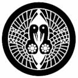 | [简介](https://baike.baidu.com/item/%E5%8D%97%E9%83%A8%E6%B0%8F/3461622?fr=aladdin)
高水寺斯波氏 | 高水寺斯波氏 |  | [简介](https://zh.wikipedia.org/wiki/%E6%96%AF%E6%B3%A2%E6%B0%8F), 源自清和天皇後代源義家之子義國足利氏的後代。
葛西氏 | 葛西氏 | 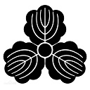 | [简介](https://baike.baidu.com/item/%E8%91%9B%E8%A5%BF%E6%B0%8F/23674166?fr=aladdin)
大崎氏 | 大崎氏 |  | [简介](https://zh.wikipedia.org/wiki/%E5%A4%A7%E5%B4%8E%E7%BE%A9%E7%9B%B4), 代表人物大崎義直
伊达氏 | 伊達氏 |  | [简介](https://zh.wikipedia.org/wiki/%E4%BC%8A%E9%81%94%E6%B0%8F), 游戏内常见角色, 伊达政宗
陆奥伊达氏 | 陸奧伊達氏 |  | [简介](https://zh.wikipedia.org/wiki/%E9%99%B8%E5%A5%A7%E5%9C%8B), 一般称为陆奥国
相马氏 | 相馬氏 |  | [简介](https://baike.baidu.com/item/%E7%9B%B8%E9%A9%AC%E6%B0%8F/4266767)
二本松氏 | 二本松氏 | *待补充*| [二本松義繼](https://zh.wikipedia.org/wiki/%E4%BA%8C%E6%9C%AC%E6%9D%BE%E7%BE%A9%E7%B9%BC)
田村氏 | 田村氏 |   | [简介](https://baike.baidu.com/item/%E7%94%B0%E6%9D%91%E6%B0%8F/1588956?fr=aladdin)
岩城氏 | 岩城氏 |  | [简介](http://www.newtenka.cn/daming/02/wujiang/12/12.htm)
陆奥石川氏 | 陸奧石川氏 | 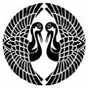 | [石川昭光](https://zh.wikipedia.org/wiki/%E7%9F%B3%E5%B7%9D%E6%98%AD%E5%85%89)
白河结成氏 | 白河結城氏 |  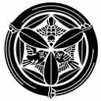 | [简介](https://www.douban.com/note/606698633/)
二阶堂氏 | 二階堂氏 |   | [简介](https://baike.baidu.com/item/%E4%BA%8C%E9%98%B6%E5%A0%82%E6%B0%8F/3461022?fr=aladdin)
芦名氏 | 蘆名氏 |  | [简介](https://baike.baidu.com/item/%E8%8A%A6%E5%90%8D%E6%B0%8F/3461451?fr=aladdin)
秋田(安东)氏 | 秋田(安東)氏 |  | [简介](https://ja.wikipedia.org/wiki/%E5%AE%89%E6%9D%B1%E6%B0%8F)
户泽(沢)氏 | 戶澤氏 | *待补充* | [简介](https://baike.baidu.com/item/%E6%88%B7%E6%B3%BD%E6%B0%8F/128410?fr=aladdin)
小野寺氏 | 小野寺氏 | 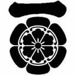 | [简介](https://baike.baidu.com/item/%E5%B0%8F%E9%87%8E%E5%AF%BA%E6%B0%8F/1500551?fr=aladdin)
大宝寺(武藤)氏 | 大宝寺(武藤)氏 | 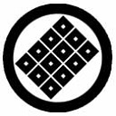 | [简介](http://www.newtenka.cn/daming/02/wujiang/06/06.htm)
天童氏 | 天童氏 |  | [简介](https://baike.baidu.com/item/%E5%A4%A9%E7%AB%A5%E6%B0%8F/4666779?fr=aladdin)
出羽最上氏 | 出羽最上氏 |  | [简介](https://zh.wikipedia.org/wiki/%E6%9C%80%E4%B8%8A%E6%B0%8F)

## 東國(關東)

（常陸、下野、上野、下總、上總、安房、武藏、相模、伊豆）

名(简) | 名(繁) | 家纹 | 介绍
------------ | ------------ | ------------- | -------------
常陆佐竹氏pedia | 常陸佐竹氏 | 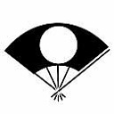 | [简介](https://zh.wiki.org/wiki/%E4%BD%90%E7%AB%B9%E6%B0%8F)
小田氏 | 小田氏 | 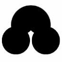 | [小田氏](https://ja.wikipedia.org/wiki/%E5%B0%8F%E7%94%B0%E6%B0%8F)
那须氏 | 那須氏 |  | [简介](https://baike.baidu.com/item/%E9%82%A3%E9%A1%BB%E6%B0%8F/1745111?fr=aladdin)
下野宇都宫氏 | 下野宇都宮氏 |  | [简介](https://baike.baidu.com/item/%E5%AE%87%E9%83%BD%E5%AE%AB%E6%B0%8F/10392002?fr=aladdin)
佐野氏 | 佐野氏 |  | [简介](https://zh.wikipedia.org/wiki/%E4%BD%90%E9%87%8E%E6%B0%8F)
壬生氏 | 壬生氏 |  | [简介](https://ja.wikipedia.org/wiki/%E5%A3%AC%E7%94%9F%E6%B0%8F)
皆川氏 | 皆川氏 |  | [简介](https://ja.wikipedia.org/wiki/%E7%9A%86%E5%B7%9D%E6%B0%8F)
小山氏 | 小山氏 |  | [简介](https://ja.wikipedia.org/wiki/%E5%B0%8F%E5%B1%B1%E6%B0%8F)
山內上杉氏 | 山內上杉氏 |  | [简介](https://zh.wikipedia.org/wiki/%E4%B8%8A%E6%9D%89%E6%B0%8F)
横濑氏(由良氏) | 橫瀨氏(由良氏) |  | [简介](http://www2.harimaya.com/sengoku/html/yura_k.html)
上野长野氏 | 上野長野氏 |  | [长野业正](https://baike.baidu.com/item/%E9%95%BF%E9%87%8E%E4%B8%9A%E6%AD%A3/9143720?fr=aladdin)
下总结成氏 | 下總結城氏 |  | [简介](https://baike.baidu.com/item/%E7%BB%93%E5%9F%8E%E6%B0%8F)
千叶氏 | 千葉氏 |  | [简介](https://zh.wikipedia.org/wiki/%E5%8D%83%E5%8F%B6%E6%B0%8F)
上总武田氏 | 上總武田氏 |  | [简介](https://zh.wikipedia.org/wiki/%E6%AD%A6%E7%94%B0%E6%B0%8F)
安房正木氏 | 安房正木氏 |  | [简介](https://www.douban.com/note/606550274/)
安房里见氏 | 安房里見氏 |  | [简介](https://zh.wikipedia.org/wiki/%E9%87%8C%E8%A6%8B%E6%B0%8F)
扇谷上杉氏 | 扇谷上杉氏 |  | [简介](https://zh.wikipedia.org/wiki/%E6%89%87%E8%B0%B7%E4%B8%8A%E6%9D%89%E5%AE%B6)
多贺谷氏 | 多賀谷氏 | 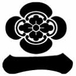 | [多贺谷重经](https://baike.baidu.com/item/%E5%A4%9A%E8%B4%BA%E8%B0%B7%E9%87%8D%E7%BB%8F)
江户氏 | 江戶氏 | *待补充* | *待补充*
相模三浦氏 | 相模三浦氏 |  | [简介](https://baike.baidu.com/item/%E4%B8%89%E6%B5%A6%E6%B0%8F)
相模北条氏 | 相模北條氏 |  | [简介](https://baike.baidu.com/item/%E5%90%8E%E5%8C%97%E6%9D%A1%E6%B0%8F)

## 中部

（佐渡、越後、越中、能登、加賀、越前、甲斐、信濃、飛驒、美濃、駿河、遠江、三河、尾張）

名(简) | 名(繁) | 家纹 | 介绍
------------ | ------------ | ------------- | -------------
越后长尾氏 | 越後長尾氏（上杉氏） |  | [上杉谦信](https://baike.baidu.com/item/%E4%B8%8A%E6%9D%89%E8%B0%A6%E4%BF%A1/79375?fromtitle=%E8%B6%8A%E5%90%8E%E4%B9%8B%E9%BE%99&fromid=285472)
越中神保氏 | 越中神保氏 |  | [简介](https://baike.baidu.com/item/%E7%A5%9E%E4%BF%9D%E6%B0%8F)
越中椎名氏 | 越中椎名氏 | 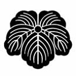 | [简介](https://baike.baidu.com/item/%E6%A4%8E%E5%90%8D%E6%B0%8F)
能登畠山氏 | 能登畠山氏 |  | [简介](https://baike.baidu.com/item/%E7%95%A0%E5%B1%B1%E6%B0%8F)
越前朝仓氏 | 越前朝倉氏 |  | [简介](https://baike.baidu.com/item/%E6%9C%9D%E4%BB%93%E6%B0%8F)
甲斐武田氏 | 甲斐武田氏 |  | [简介](https://baike.baidu.com/item/%E7%94%B2%E6%96%90%E6%AD%A6%E7%94%B0%E6%B0%8F)
信浓村上氏 | 信濃村上氏 | 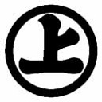 | [简介](https://baike.baidu.com/item/%E6%9D%91%E4%B8%8A%E6%B0%8F)
高梨氏 | 高梨氏 |  | [高梨政赖](https://baike.baidu.com/item/%E9%AB%98%E6%A2%A8%E6%94%BF%E8%B5%96)
真田氏 | 真田氏 |  | [简介](https://baike.baidu.com/item/%E7%9C%9F%E7%94%B0%E6%B0%8F)
海野氏 | 海野氏 |   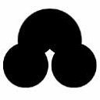 | [简介](https://baike.baidu.com/item/%E6%B5%B7%E9%87%8E%E6%B0%8F)
仁科氏 | 仁科氏 | 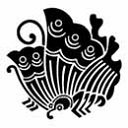  | [仁科盛信](https://baike.baidu.com/item/%E4%BB%81%E7%A7%91%E7%9B%9B%E4%BF%A1)
东信浓小笠原氏(府中小笠原氏) | 東信濃小笠原氏(府中小笠原氏) |  | [简介](https://baike.baidu.com/item/%E5%B0%8F%E7%AC%A0%E5%8E%9F%E6%B0%8F)
南信浓诹访氏 | 南信濃諏(zōu)訪氏 | 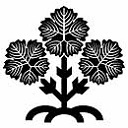 | [诹访赖重](https://baike.baidu.com/item/%E8%AF%B9%E8%AE%BF%E8%B5%96%E9%87%8D)
西信浓木曾氏 | 西信濃木曾氏 |   | [木曾义昌](https://baike.baidu.com/item/%E6%9C%A8%E6%9B%BE%E4%B9%89%E6%98%8C)
飞驒江马氏 | 飛驒(tuó)江馬氏 |  | [江馬輝盛](https://zh.wikipedia.org/wiki/%E6%B1%9F%E9%A6%AC%E8%BC%9D%E7%9B%9B)
飞驒三木氏(姊小路氏) | 飛驒三木氏(姉(zǐ)小路氏) |  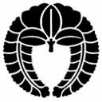 | [三木氏](https://baike.baidu.com/item/%E4%B8%89%E6%9C%A8%E6%B0%8F) [姉小路氏](https://baike.baidu.com/item/%E5%A7%8A%E5%B0%8F%E8%B7%AF%E6%B0%8F)

## 近畿

## 中國・四國

## 九州

## 特殊

名(简) | 名(繁) | 家纹 | 介绍
------------ | ------------ | ------------- | -------------
石田 三成 | 石田 三成 |   | [简介](https://zh.wikipedia.org/wiki/%E7%9F%B3%E7%94%B0%E4%B8%89%E6%88%90)
