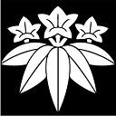

# 日本战国家纹

## 蝦夷(北海道)・東北

（蝦夷地、陸奧、出羽）

名(简) | 名(繁) | 家纹 | 介绍
------------ | ------------ | ------------- | -------------
松前 庆广 | 松前 慶廣 | *未收集* | [简介](https://zh.wikipedia.org/wiki/%E6%9D%BE%E5%89%8D%E6%85%B6%E5%BB%A3)
津轻氏 | 津輕氏 |  | [简介](https://zh.wikipedia.org/wiki/%E6%B4%A5%E8%BC%95%E6%B0%8F), 其後改姓大浦
浪冈北畠(tián)氏 | 浪岡北畠氏 |  | [简介](https://baike.baidu.com/item/%E6%B5%AA%E5%86%88%E5%8C%97%E7%95%A0%E6%B0%8F/13826825?fr=aladdin)
南部晴政 | 南部晴政 |  | [简介](https://zh.wikipedia.org/wiki/%E5%8D%97%E9%83%A8%E6%99%B4%E6%94%BF)
高水寺斯波氏 | 高水寺斯波氏 |  | [简介](https://zh.wikipedia.org/wiki/%E6%96%AF%E6%B3%A2%E6%B0%8F), 源自清和天皇後代源義家之子義國足利氏的後代。

## 東國(關東)

## 中部

## 近畿

## 中國・四國

## 九州

## 特殊

名(简) | 名(繁) | 家纹 | 介绍
------------ | ------------ | ------------- | -------------
石田 三成 | 石田 三成 |  | [简介]((https://zh.wikipedia.org/wiki/%E7%9F%B3%E7%94%B0%E4%B8%89%E6%88%90))
