# 日本战国家纹

- [日本战国家纹](#日本战国家纹)
    - [蝦夷(北海道)・東北](#蝦夷北海道東北)
    - [東國(關東)](#東國關東)
    - [中部](#中部)
    - [近畿[jī]](#近畿jī)
    - [中國・四國](#中國四國)
    - [九州](#九州)
    - [特殊](#特殊)

## 蝦夷(北海道)・東北

（蝦夷地、陸奧、出羽）

名(简) | 名(繁) | 家纹 | 介绍
------------ | ------------ | ------------- | -------------
蛎崎(松前)氏 | 蠣崎(松前)氏 |  | [简介](https://baike.baidu.com/item/%E8%9B%8E%E5%B4%8E%E6%B0%8F/24431389)
津轻氏 | 津輕氏 |  | [简介](https://zh.wikipedia.org/wiki/%E6%B4%A5%E8%BC%95%E6%B0%8F)
浪冈北畠(tián)氏 | 浪岡北畠氏 |  | [简介](https://baike.baidu.com/item/%E6%B5%AA%E5%86%88%E5%8C%97%E7%95%A0%E6%B0%8F/13826825?fr=aladdin)
南部氏 | 南部氏 |  | [简介](https://baike.baidu.com/item/%E5%8D%97%E9%83%A8%E6%B0%8F/3461622?fr=aladdin)
高水寺斯波氏 | 高水寺斯波氏 |  | [简介](https://zh.wikipedia.org/wiki/%E6%96%AF%E6%B3%A2%E6%B0%8F)
葛西氏 | 葛西氏 |  | [简介](https://baike.baidu.com/item/%E8%91%9B%E8%A5%BF%E6%B0%8F/23674166?fr=aladdin)
大崎氏 | 大崎氏 |  | [简介](https://zh.wikipedia.org/wiki/%E5%A4%A7%E5%B4%8E%E7%BE%A9%E7%9B%B4)
伊达氏 | 伊達氏 | 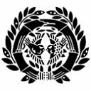 | [简介](https://zh.wikipedia.org/wiki/%E4%BC%8A%E9%81%94%E6%B0%8F)
陆奥伊达氏 | 陸奧伊達氏 |  | [简介](https://zh.wikipedia.org/wiki/%E9%99%B8%E5%A5%A7%E5%9C%8B)
相马氏 | 相馬氏 |  | [简介](https://baike.baidu.com/item/%E7%9B%B8%E9%A9%AC%E6%B0%8F/4266767)
二本松氏 | 二本松氏 | *待补充*| [二本松義繼](https://zh.wikipedia.org/wiki/%E4%BA%8C%E6%9C%AC%E6%9D%BE%E7%BE%A9%E7%B9%BC)
田村氏 | 田村氏 |   | [简介](https://baike.baidu.com/item/%E7%94%B0%E6%9D%91%E6%B0%8F/1588956?fr=aladdin)
岩城氏 | 岩城氏 |  | [简介](http://www.newtenka.cn/daming/02/wujiang/12/12.htm)
陆奥石川氏 | 陸奧石川氏 |  | [石川昭光](https://zh.wikipedia.org/wiki/%E7%9F%B3%E5%B7%9D%E6%98%AD%E5%85%89)
白河结成氏 | 白河結城氏 |   | [简介](https://www.douban.com/note/606698633/)
二阶堂氏 | 二階堂氏 |   | [简介](https://baike.baidu.com/item/%E4%BA%8C%E9%98%B6%E5%A0%82%E6%B0%8F/3461022?fr=aladdin)
芦名氏 | 蘆名氏 |  | [简介](https://baike.baidu.com/item/%E8%8A%A6%E5%90%8D%E6%B0%8F/3461451?fr=aladdin)
秋田(安东)氏 | 秋田(安東)氏 |  | [简介](https://ja.wikipedia.org/wiki/%E5%AE%89%E6%9D%B1%E6%B0%8F)
户泽(沢)氏 | 戶澤氏 | *待补充* | [简介](https://baike.baidu.com/item/%E6%88%B7%E6%B3%BD%E6%B0%8F/128410?fr=aladdin)
小野寺氏 | 小野寺氏 |  | [简介](https://baike.baidu.com/item/%E5%B0%8F%E9%87%8E%E5%AF%BA%E6%B0%8F/1500551?fr=aladdin)
大宝寺(武藤)氏 | 大宝寺(武藤)氏 |  | [简介](http://www.newtenka.cn/daming/02/wujiang/06/06.htm)
天童氏 | 天童氏 |  | [简介](https://baike.baidu.com/item/%E5%A4%A9%E7%AB%A5%E6%B0%8F/4666779?fr=aladdin)
出羽最上氏 | 出羽最上氏 |  | [简介](https://zh.wikipedia.org/wiki/%E6%9C%80%E4%B8%8A%E6%B0%8F)

## 東國(關東)

（常陸、下野、上野、下總、上總、安房、武藏、相模、伊豆）

名(简) | 名(繁) | 家纹 | 介绍
------------ | ------------ | ------------- | -------------
常陆佐竹氏pedia | 常陸佐竹氏 |  | [简介](https://zh.wiki.org/wiki/%E4%BD%90%E7%AB%B9%E6%B0%8F)
小田氏 | 小田氏 |  | [小田氏](https://ja.wikipedia.org/wiki/%E5%B0%8F%E7%94%B0%E6%B0%8F)
那须氏 | 那須氏 |  | [简介](https://baike.baidu.com/item/%E9%82%A3%E9%A1%BB%E6%B0%8F/1745111?fr=aladdin)
下野宇都宫氏 | 下野宇都宮氏 |  | [简介](https://baike.baidu.com/item/%E5%AE%87%E9%83%BD%E5%AE%AB%E6%B0%8F/10392002?fr=aladdin)
佐野氏 | 佐野氏 |  | [简介](https://zh.wikipedia.org/wiki/%E4%BD%90%E9%87%8E%E6%B0%8F)
壬生氏 | 壬生氏 |  | [简介](https://ja.wikipedia.org/wiki/%E5%A3%AC%E7%94%9F%E6%B0%8F)
皆川氏 | 皆川氏 |  | [简介](https://ja.wikipedia.org/wiki/%E7%9A%86%E5%B7%9D%E6%B0%8F)
小山氏 | 小山氏 |  | [简介](https://ja.wikipedia.org/wiki/%E5%B0%8F%E5%B1%B1%E6%B0%8F)
山內上杉氏 | 山內上杉氏 |  | [简介](https://zh.wikipedia.org/wiki/%E4%B8%8A%E6%9D%89%E6%B0%8F)
横濑氏(由良氏) | 橫瀨氏(由良氏) |  | [简介](http://www2.harimaya.com/sengoku/html/yura_k.html)
上野长野氏 | 上野長野氏 | 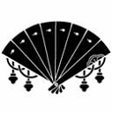 | [长野业正](https://baike.baidu.com/item/%E9%95%BF%E9%87%8E%E4%B8%9A%E6%AD%A3/9143720?fr=aladdin)
下总结成氏 | 下總結城氏 |  | [简介](https://baike.baidu.com/item/%E7%BB%93%E5%9F%8E%E6%B0%8F)
千叶氏 | 千葉氏 |  | [简介](https://zh.wikipedia.org/wiki/%E5%8D%83%E5%8F%B6%E6%B0%8F)
上总武田氏 | 上總武田氏 |  | [简介](https://zh.wikipedia.org/wiki/%E6%AD%A6%E7%94%B0%E6%B0%8F)
安房正木氏 | 安房正木氏 |  | [简介](https://www.douban.com/note/606550274/)
安房里见氏 | 安房里見氏 |  | [简介](https://zh.wikipedia.org/wiki/%E9%87%8C%E8%A6%8B%E6%B0%8F)
扇谷上杉氏 | 扇谷上杉氏 |  | [简介](https://zh.wikipedia.org/wiki/%E6%89%87%E8%B0%B7%E4%B8%8A%E6%9D%89%E5%AE%B6)
多贺谷氏 | 多賀谷氏 |  | [多贺谷重经](https://baike.baidu.com/item/%E5%A4%9A%E8%B4%BA%E8%B0%B7%E9%87%8D%E7%BB%8F)
江户氏 | 江戶氏 | *待补充* | *待补充*
相模三浦氏 | 相模三浦氏 | 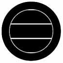 | [简介](https://baike.baidu.com/item/%E4%B8%89%E6%B5%A6%E6%B0%8F)
相模北条氏 | 相模北條氏 | 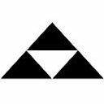 | [简介](https://baike.baidu.com/item/%E5%90%8E%E5%8C%97%E6%9D%A1%E6%B0%8F)

## 中部

（佐渡、越後、越中、能登、加賀、越前、甲斐、信濃、飛驒、美濃、駿河、遠江、三河、尾張）

名(简) | 名(繁) | 家纹 | 介绍
------------ | ------------ | ------------- | -------------
越后长尾氏 | 越後長尾氏（上杉氏） |  | [上杉谦信](https://baike.baidu.com/item/%E4%B8%8A%E6%9D%89%E8%B0%A6%E4%BF%A1/79375?fromtitle=%E8%B6%8A%E5%90%8E%E4%B9%8B%E9%BE%99&fromid=285472)
越中神保氏 | 越中神保氏 |  | [简介](https://baike.baidu.com/item/%E7%A5%9E%E4%BF%9D%E6%B0%8F)
越中椎名氏 | 越中椎名氏 |  | [简介](https://baike.baidu.com/item/%E6%A4%8E%E5%90%8D%E6%B0%8F)
能登畠山氏 | 能登畠山氏 |  | [简介](https://baike.baidu.com/item/%E7%95%A0%E5%B1%B1%E6%B0%8F)
越前朝仓氏 | 越前朝倉氏 | 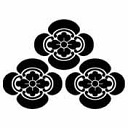 | [简介](https://baike.baidu.com/item/%E6%9C%9D%E4%BB%93%E6%B0%8F)
甲斐武田氏 | 甲斐武田氏 |  | [简介](https://baike.baidu.com/item/%E7%94%B2%E6%96%90%E6%AD%A6%E7%94%B0%E6%B0%8F)
信浓村上氏 | 信濃村上氏 |  | [简介](https://baike.baidu.com/item/%E6%9D%91%E4%B8%8A%E6%B0%8F)
高梨氏 | 高梨氏 |  | [高梨政赖](https://baike.baidu.com/item/%E9%AB%98%E6%A2%A8%E6%94%BF%E8%B5%96)
真田氏 | 真田氏 |  | [简介](https://baike.baidu.com/item/%E7%9C%9F%E7%94%B0%E6%B0%8F)
海野氏 | 海野氏 |    | [简介](https://baike.baidu.com/item/%E6%B5%B7%E9%87%8E%E6%B0%8F)
仁科氏 | 仁科氏 |   | [仁科盛信](https://baike.baidu.com/item/%E4%BB%81%E7%A7%91%E7%9B%9B%E4%BF%A1)
东信浓小笠原氏(府中小笠原氏) | 東信濃小笠原氏(府中小笠原氏) |  | [简介](https://baike.baidu.com/item/%E5%B0%8F%E7%AC%A0%E5%8E%9F%E6%B0%8F)
南信浓诹访氏 | 南信濃諏(zōu)訪氏 |  | [诹访赖重](https://baike.baidu.com/item/%E8%AF%B9%E8%AE%BF%E8%B5%96%E9%87%8D)
西信浓木曾氏 | 西信濃木曾氏 |   | [木曾义昌](https://baike.baidu.com/item/%E6%9C%A8%E6%9B%BE%E4%B9%89%E6%98%8C)
飞驒江马氏 | 飛驒(tuó)江馬氏 |  | [江馬輝盛](https://zh.wikipedia.org/wiki/%E6%B1%9F%E9%A6%AC%E8%BC%9D%E7%9B%9B)
飞驒三木氏(姊小路氏) | 飛驒三木氏(姉(zǐ)小路氏) |   | [三木氏](https://baike.baidu.com/item/%E4%B8%89%E6%9C%A8%E6%B0%8F) [姉小路氏](https://baike.baidu.com/item/%E5%A7%8A%E5%B0%8F%E8%B7%AF%E6%B0%8F)
美浓土岐氏 | 美濃土岐氏 | 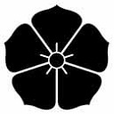 | [简介](https://baike.baidu.com/item/%E5%9C%9F%E5%B2%90%E6%B0%8F)
美浓斋藤氏 | 美濃齋藤氏 | 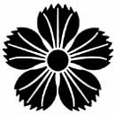 | [简介](https://zh.wikipedia.org/wiki/%E9%BD%8B%E8%97%A4%E6%B0%8F#%E7%BE%8E%E6%BF%83%E9%BD%8B%E8%97%A4%E6%B0%8F)
骏河金川氏 | 駿河今川氏 |  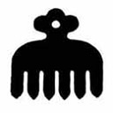 | [简介](https://baike.baidu.com/item/%E4%BB%8A%E5%B7%9D%E6%B0%8F)
三河松平氏(德川氏) | 三河松平氏(德川氏) |  | [简介](https://baike.baidu.com/item/%E5%BE%B7%E5%B7%9D%E6%B0%8F)
三河水野氏 | 三河水野氏 |  | [简介](http://www2.harimaya.com/sengoku/html/mizuno.html)
尾张斯波氏 | 尾張斯波氏 |  | [简介](https://zh.wikipedia.org/wiki/%E6%96%AF%E6%B3%A2%E6%B0%8F)
尾张织田氏 | 尾張織田氏 | 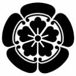 | [简介](https://zh.wikipedia.org/wiki/%E7%B9%94%E7%94%B0%E6%B0%8F)

## 近畿[jī]

（近江、若狹、丹後、丹波、山城、伊勢、志摩、伊賀、大和、紀伊、河內、和泉、摂津、播磨、但馬、因幡）

名(简) | 名(繁) | 家纹 | 介绍
------------ | ------------ | ------------- | -------------
京极氏 | 京極氏 |  | [简介](https://baike.baidu.com/item/%E4%BA%AC%E6%9E%81%E6%B0%8F)
北近江浅井氏 | 北近江淺井氏 |  | [简介](https://baike.baidu.com/item/%E6%B5%85%E4%BA%95%E6%B0%8F)
南近江六角氏 | 南近江六角氏 |  | [简介](https://baike.baidu.com/item/%E5%85%AD%E8%A7%92%E6%B0%8F)
若狭武田氏 | 若狹武田氏 |  | [简介](https://baike.baidu.com/item/%E8%8B%A5%E7%8B%AD%E6%AD%A6%E7%94%B0%E6%B0%8F)
丹后一色氏 | 丹後一色氏 | 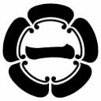 | [简介](https://baike.baidu.com/item/%E4%B8%80%E8%89%B2%E6%B0%8F)
內藤氏 | 內藤氏 |  | [内藤清成](https://baike.baidu.com/item/%E5%86%85%E8%97%A4%E6%B8%85%E6%88%90)
丹波赤井氏 | 丹波赤井氏 |  | [简介](https://baike.baidu.com/item/%E8%B5%A4%E4%BA%95%E6%B0%8F)
丹波波多野氏 | 丹波波多野氏 |  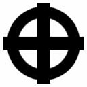 | [简介](https://baike.baidu.com/item/%E6%B3%A2%E5%A4%9A%E9%87%8E%E6%B0%8F)
伊势关氏 | 伊勢關氏 |  | [简介](http://www2.harimaya.com/sengoku/html/seki_k.html)
伊势神户氏 | 伊勢神戶氏 |  | [神戶具盛](https://zh.wikipedia.org/wiki/%E7%A5%9E%E6%88%B6%E5%85%B7%E7%9B%9B)
伊势长野工藤氏 | 伊勢長野工藤氏 |  | [長野稙藤](https://zh.wikipedia.org/wiki/%E9%95%B7%E9%87%8E%E7%A8%99%E8%97%A4)
伊勢北畠氏 | 伊勢北畠氏 |  | [北畠具教](https://baike.baidu.com/item/%E5%8C%97%E7%95%A0%E5%85%B7%E6%95%99/128762) [北畠晴具](https://zh.wikipedia.org/wiki/%E5%8C%97%E7%95%A0%E6%99%B4%E5%85%B7)
大和筒井氏 | 大和筒井氏 | 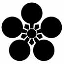  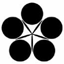 | [筒井顺昭](https://baike.baidu.com/item/%E7%AD%92%E4%BA%95%E9%A1%BA%E6%98%AD) [筒井順慶](https://zh.wikipedia.org/wiki/%E7%AD%92%E4%BA%95%E9%A0%86%E6%85%B6)
大和越智氏 | 大和越智氏 | 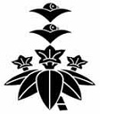 | [简介](http://www2.harimaya.com/sengoku/html/oti_k.html)
大和松永氏 | 大和松永氏 |  | [松永久秀](https://baike.baidu.com/item/%E6%9D%BE%E6%B0%B8%E4%B9%85%E7%A7%80/77907)
河內畠山氏 | 河內畠山氏 |   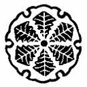 | [简介](https://zh.wikipedia.org/wiki/%E7%95%A0%E5%B1%B1%E6%B0%8F)
山城细川氏 | 山城細川氏 |  | [简介](https://baike.baidu.com/item/%E7%BB%86%E5%B7%9D%E6%B0%8F)
播磨赤松氏 | 播磨赤松氏 |  | [简介](https://baike.baidu.com/item/%E8%B5%A4%E6%9D%BE%E6%B0%8F)
播磨別所氏 | 播磨別所氏 |  | [別所就治](https://zh.wikipedia.org/wiki/%E5%88%A5%E6%89%80%E5%B0%B1%E6%B2%BB)
因幡山名氏 | 因幡[fān]山名氏 |  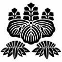 | [简介](https://baike.baidu.com/item/%E5%B1%B1%E5%90%8D%E6%B0%8F)
伊贺仁木氏 | 伊賀仁木氏 |  | [简介](http://www2.harimaya.com/sengoku/html/niki_k.html)

## 中國・四國

（美作、備前、備中、備後、安藝、伯耆、隱岐、出雲、石見、周防、長門、讚岐、阿波、淡路、土佐、伊予）

名(简) | 名(繁) | 家纹 | 介绍
------------ | ------------ | ------------- | -------------
美作后藤氏 | 美作後藤氏 | 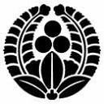 | [后藤基次](https://baike.baidu.com/item/%E5%90%8E%E8%97%A4%E5%9F%BA%E6%AC%A1/8944534?fromtitle=%E5%90%8E%E8%97%A4%E5%8F%88%E5%85%B5%E5%8D%AB%E5%9F%BA%E6%AC%A1&fromid=5891022)
美作三浦氏 | 美作三浦氏 |  | [简介](http://www2.harimaya.com/sengoku/html/mi_miura.html)
美作浦上氏 | 美作浦上氏 |  | [浦上宗景](https://baike.baidu.com/item/%E6%B5%A6%E4%B8%8A%E5%AE%97%E6%99%AF)
备前宇喜多氏 | 備前宇喜多氏 |  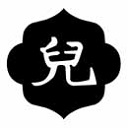 | [简介](https://zh.wikipedia.org/wiki/%E5%AE%87%E5%96%9C%E5%A4%9A%E6%B0%8F)
备前松田氏 | 備前松田氏 |   | [简介](http://www2.harimaya.com/sengoku/html/b_matuda.html)
庄氏 | 庄(荘)氏 | 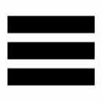 | [庄元祐](https://zh.wikipedia.org/wiki/%E5%BA%84%E5%85%83%E7%A5%90)
备中三村氏 | 備中三村氏 | 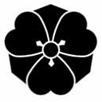 | [三村元亲](https://baike.baidu.com/item/%E4%B8%89%E6%9D%91%E5%85%83%E4%BA%B2)
备后山内氏 | 備後山內氏 | 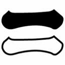 | [山内一丰](https://baike.baidu.com/item/%E5%B1%B1%E5%86%85%E4%B8%80%E4%B8%B0)
安艺武田氏 | 安藝武田氏 |  | [简介](https://zh.wikipedia.org/wiki/%E6%AD%A6%E7%94%B0%E6%B0%8F)
安艺毛利氏 | 安藝毛利氏 | 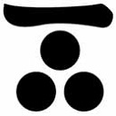 | [简介](https://baike.baidu.com/item/%E6%AF%9B%E5%88%A9%E6%B0%8F)
出云吉川氏 | 出雲吉川氏 |   | [简介](http://www2.harimaya.com/sengoku/html/kikka.html)
安艺小早川氏 | 安藝小早川氏 |  | [简介](https://baike.baidu.com/item/%E5%B0%8F%E6%97%A9%E5%B7%9D%E6%B0%8F)
南条氏 | 南條氏 |  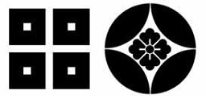 | [简介](http://www2.harimaya.com/sengoku/html/nanjo_k.html)
出云尼子氏 | 出雲尼子氏 |  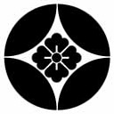 | [简介](http://www.360doc.com/content/20/0128/21/1414235_888380236.shtml)
周防大內氏 | 周防大內氏 | 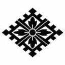 | [简介](https://baike.baidu.com/item/%E5%A4%A7%E5%86%85%E6%B0%8F)
赞岐十河氏 | 讚岐十河氏 | 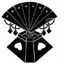 | [十河一存](https://baike.baidu.com/item/%E5%8D%81%E6%B2%B3%E4%B8%80%E5%AD%98)
阿波三好氏 | 阿波三好氏 |  | [简介](https://baike.baidu.com/item/%E4%B8%89%E5%A5%BD%E6%B0%8F)
安艺氏 | 安藝氏 | 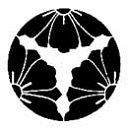 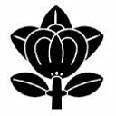  | [简介](http://blog.sina.com.cn/s/blog_67e1476c0100s0rz.html)
本山氏 | 本山氏 |  | [本山亲茂](https://baike.baidu.com/item/%E6%9C%AC%E5%B1%B1%E4%BA%B2%E8%8C%82) [本山茂辰](https://baike.baidu.com/item/%E6%9C%AC%E5%B1%B1%E8%8C%82%E8%BE%B0)
士佐长宗我部氏 | 土佐長宗我部氏 |  | [简介](https://baike.baidu.com/item/%E9%95%BF%E5%AE%97%E6%88%91%E9%83%A8%E6%B0%8F)
土佐一条氏 | 土佐一條氏 | 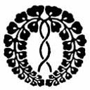 | [简介](https://baike.baidu.com/item/%E5%9C%9F%E4%BD%90%E4%B8%80%E6%9D%A1%E6%B0%8F)
伊予河野氏 | 伊予河野氏 |  | [简介](https://baike.baidu.com/item/%E6%B2%B3%E9%87%8E%E6%B0%8F)
伊予宇都宮氏 | 伊予宇都宮氏 |  | [简介](https://baike.baidu.com/item/%E5%AE%87%E9%83%BD%E5%AE%AB%E6%B0%8F/10392002?fr=aladdin)
伊予西园寺氏 | 伊予西園寺氏 |  | [简介](https://baike.baidu.com/item/%E8%A5%BF%E5%9B%AD%E5%AF%BA%E6%B0%8F)

## 九州

## 特殊

名(简) | 名(繁) | 家纹 | 介绍
------------ | ------------ | ------------- | -------------
石田 三成 | 石田 三成 | 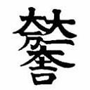  | [简介](https://zh.wikipedia.org/wiki/%E7%9F%B3%E7%94%B0%E4%B8%89%E6%88%90)
儿玉党 | 児玉党 | 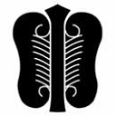  | *待补充*
